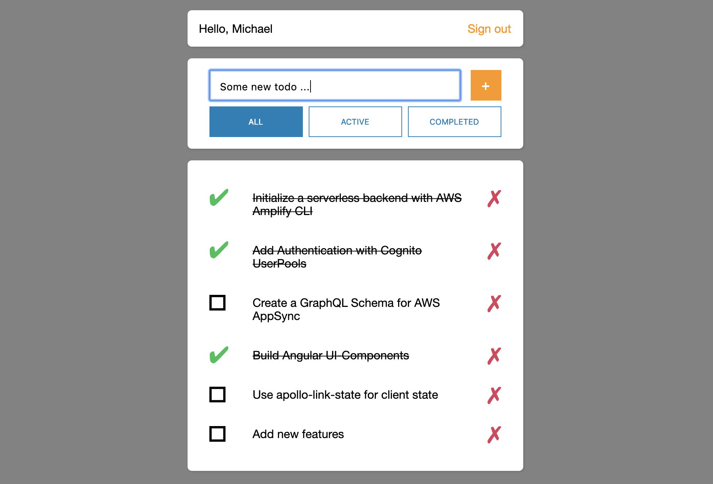

# Angular with NX multi-app setup powered by an AWS Amplify GraphQL Backend



## Getting started

To deploy this project, go through the following steps:

1. Clone this repo

```sh
git clone https://github.com/BeaveArony/amplify-angular-nx-todo.git
```

2. Change into the directory & install the dependencies

```sh
npm install

# or

yarn
```

3. Initialize the Amplify project

```sh
amplify init
```

4. Create the resources in your account

```sh
amplify push
```

5. Start the app

```sh
npm start
```
